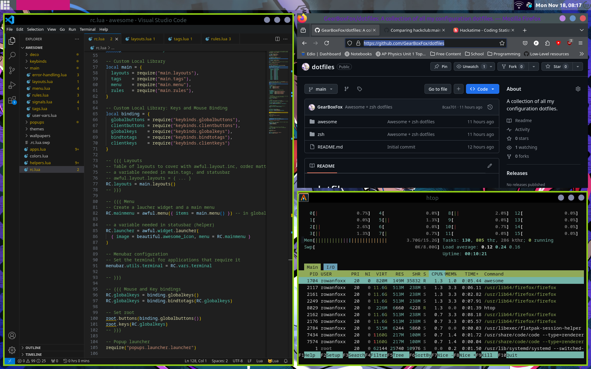

# dotfiles
A collection of all my configuration dotfiles.

## Features
- Clean design, low amounts of clutter
- Easy-to-read config makes it easy to modify
- All the essential widgets
    - Battery Indicator
    - Volume OSD
    - Brightness OSD
    - Lock screen
- Easy theming using xrdb
- Intuitive, graphical app launcher

## Installing
This configuration wasn't initially created with the intent of being copied, but I would be glad to help
set up the config.

### Dependencies
- AwesomeWM: Use the git version. Stable version will not work.
- Picom: Use any picom fork of your liking.
- nm-applet: Used for wifi.
- Light: Required for the brightness control slider
- Alsa Utils: Required for the volume control slider.
- acpi: Required for the battery widget. You can skip that if you don't have a battery.
- Nitrogen: Another wallpaper setter. This is optional though.
- Font: Ubuntu Nerd font is used most of the ui, CaskaydiaCove nerd font and JetbrainsMono nerd font is also used in some place.
- Icon Theme: Papirus(required)
- GTK Theme: Lavanda Dark Compact Tokyonight (Thanks to Mebesus)

<details>
<summary><b style="font-size:20px">Install Awesome-git</b></summary>

<br>
<b>Arch</b>

```bash
yay -S awesome-git
```

<br>

<b>Fedora</b><br> You can build from source, or you can use COPR if you are lazy
like me. For installing through COPR, follow below steps:-

```bash
sudo dnf copr enable coolj/awesome-luajit-nightly
sudo dnf install awesome
```

<br>

<b>Ubuntu and other Debian based</b><br> Again, you can build from source, or
you can use pacstall. To install using pacstall, followbelow steps:-

```bash
sudo bash -c "$(wget -q https://pacstall.dev/q/install -O -)"    #for setting up pacstall(Skip if you already done it)
pacstall -I awesome-git
```

</details>
<br>
<details>
<summary><b style="font-size:20px">Install Dependencies</b></summary>

Use the package manager to install the following dependencies:-

**Necessary**
```bash
nm-applet NetworkManager light alsa-utils acpi picom
```

**Optional but recommended for a complete experience**
```bash
redshift gpick nitrogen lxappearance
```
The name of some packages may vary based on your distro.


</details>
<br>
<details>
<summary><b style="font-size:20px">Move the files to their location</b></summary>

Clone this repository:-

```bash
git clone https://github.com/GearBoxFox/dotfiles.git
cd dotfiles
```

Make `~/.themes`, `~/.icons`, `~/.local/share/fonts` directories if not exists
already.

```bash
mkdir ~/.themes
mkdir ~/.icons
mkdir ~/.local/share/fonts
```

Move the files in their required directory:-

```bash
mv ~/.config/awesome ~/.config/awesome.bak
cp -r awesome ~/.config/
cp -r Misc/fonts/* ~/.local/share/fonts/
cp -r Misc/gtk_themes/* ~/.themes/
cp -r Misc/icon_packs/* ~/.icons/
```

</details>
<br>
After following all the steps restart awesome wm. Hopefully everything will work.

## Gallery



## Coming soon!
- System dock
- Sidebar with extra info
- App rules for tags
